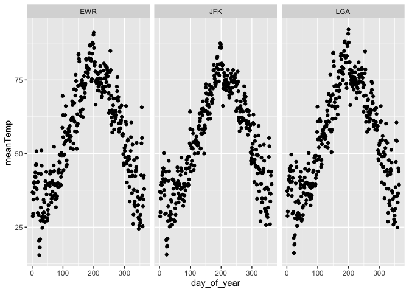

Practice Exam
=============

This practice exam asks you to do several code wrangling tasks that we
have done in class so far.

Clone this repo into Rstudio and fill in the necessary code. Then,
commit and push to github. Finally, turn in a link to canvas.

    ## ── Attaching packages ──────────────────────────────────────────────────────────────── tidyverse 1.3.0 ──

    ## ✓ ggplot2 3.2.1     ✓ purrr   0.3.3
    ## ✓ tibble  2.1.3     ✓ dplyr   0.8.4
    ## ✓ tidyr   1.0.2     ✓ stringr 1.4.0
    ## ✓ readr   1.3.1     ✓ forcats 0.4.0

    ## ── Conflicts ─────────────────────────────────────────────────────────────────── tidyverse_conflicts() ──
    ## x dplyr::filter() masks stats::filter()
    ## x dplyr::lag()    masks stats::lag()

**Make a plot with three facets, one for each airport in the weather
data. The x-axis should be the day of the year (1:365) and the y-axis
should be the mean temperature recorded on that day, at that airport.**

    library(lubridate)

    ## 
    ## Attaching package: 'lubridate'

    ## The following object is masked from 'package:base':
    ## 
    ##     date

    mutate_weather = weather %>% mutate(day_of_year = yday(time_hour))
    mutate_weather_more = mutate_weather %>% group_by(origin, day_of_year) %>% summarise(meanTemp = mean(temp))
    mutate_weather_more

    ## # A tibble: 1,092 x 3
    ## # Groups:   origin [3]
    ##    origin day_of_year meanTemp
    ##    <chr>        <dbl>    <dbl>
    ##  1 EWR              1     36.8
    ##  2 EWR              2     28.7
    ##  3 EWR              3     29.6
    ##  4 EWR              4     34.3
    ##  5 EWR              5     36.6
    ##  6 EWR              6     39.9
    ##  7 EWR              7     40.3
    ##  8 EWR              8     38.6
    ##  9 EWR              9     42.1
    ## 10 EWR             10     43.6
    ## # … with 1,082 more rows

    ggplot(data = mutate_weather_more) + 
      geom_point(mapping = aes(x = day_of_year, y = meanTemp)) + 
      facet_wrap(~ origin, nrow = 1)

    ## Warning: Removed 1 rows containing missing values (geom_point).

**Make a non-tidy matrix of that data where each row is an airport and
each column is a day of the year.**

    weather_2 = mutate_weather_more %>% pivot_wider(names_from = day_of_year, values_from = meanTemp)
    weather_2

    ## # A tibble: 3 x 365
    ## # Groups:   origin [3]
    ##   origin   `1`   `2`   `3`   `4`   `5`   `6`   `7`   `8`   `9`  `10`  `11`  `12`
    ##   <chr>  <dbl> <dbl> <dbl> <dbl> <dbl> <dbl> <dbl> <dbl> <dbl> <dbl> <dbl> <dbl>
    ## 1 EWR     36.8  28.7  29.6  34.3  36.6  39.9  40.3  38.6  42.1  43.6  42.0  46.0
    ## 2 JFK     36.9  28.6  30.1  34.7  36.8  39.3  40.1  39.4  42.7  43.6  41.3  45.0
    ## 3 LGA     37.2  28.8  30.3  35.8  38.3  41.0  41.4  42.3  44.9  44.3  40.3  43.9
    ## # … with 352 more variables: `13` <dbl>, `14` <dbl>, `15` <dbl>, `16` <dbl>,
    ## #   `17` <dbl>, `18` <dbl>, `19` <dbl>, `20` <dbl>, `21` <dbl>, `22` <dbl>,
    ## #   `23` <dbl>, `24` <dbl>, `25` <dbl>, `26` <dbl>, `27` <dbl>, `28` <dbl>,
    ## #   `29` <dbl>, `30` <dbl>, `31` <dbl>, `32` <dbl>, `33` <dbl>, `34` <dbl>,
    ## #   `35` <dbl>, `36` <dbl>, `37` <dbl>, `38` <dbl>, `39` <dbl>, `40` <dbl>,
    ## #   `41` <dbl>, `42` <dbl>, `43` <dbl>, `44` <dbl>, `45` <dbl>, `46` <dbl>,
    ## #   `47` <dbl>, `48` <dbl>, `49` <dbl>, `50` <dbl>, `51` <dbl>, `52` <dbl>,
    ## #   `53` <dbl>, `54` <dbl>, `55` <dbl>, `56` <dbl>, `57` <dbl>, `58` <dbl>,
    ## #   `59` <dbl>, `60` <dbl>, `61` <dbl>, `62` <dbl>, `63` <dbl>, `64` <dbl>,
    ## #   `65` <dbl>, `66` <dbl>, `67` <dbl>, `68` <dbl>, `69` <dbl>, `70` <dbl>,
    ## #   `71` <dbl>, `72` <dbl>, `73` <dbl>, `74` <dbl>, `75` <dbl>, `76` <dbl>,
    ## #   `77` <dbl>, `78` <dbl>, `79` <dbl>, `80` <dbl>, `81` <dbl>, `82` <dbl>,
    ## #   `83` <dbl>, `84` <dbl>, `85` <dbl>, `86` <dbl>, `87` <dbl>, `88` <dbl>,
    ## #   `89` <dbl>, `90` <dbl>, `91` <dbl>, `92` <dbl>, `93` <dbl>, `94` <dbl>,
    ## #   `95` <dbl>, `96` <dbl>, `97` <dbl>, `98` <dbl>, `99` <dbl>, `100` <dbl>,
    ## #   `101` <dbl>, `102` <dbl>, `103` <dbl>, `104` <dbl>, `105` <dbl>,
    ## #   `106` <dbl>, `107` <dbl>, `108` <dbl>, `109` <dbl>, `110` <dbl>,
    ## #   `111` <dbl>, `112` <dbl>, …

**For each (airport, day) contruct a tidy data set of the airport's
"performance" as the proportion of flights that departed less than an
hour late.**

    #flights[which(flights$dep_delay <= 1)]
    #summarise(flights, proportion = which(flights$dep_delay <= 1))

**Construct a tidy data set to that give weather summaries for each
(airport, day). Use the total precipitation, minimum visibility, maximum
wind\_gust, and average wind\_speed.**

    weather_4 = mutate_weather %>% group_by(origin, day_of_year) %>% summarise(total_precipitation = sum(mutate_weather$precip), minimum_visibility = min(mutate_weather$visib), average_wind_speed = mean(mutate_weather$wind_speed))
    weather_4

    ## # A tibble: 1,092 x 5
    ## # Groups:   origin [3]
    ##    origin day_of_year total_precipitation minimum_visibility average_wind_speed
    ##    <chr>        <dbl>               <dbl>              <dbl>              <dbl>
    ##  1 EWR              1                117.                  0                 NA
    ##  2 EWR              2                117.                  0                 NA
    ##  3 EWR              3                117.                  0                 NA
    ##  4 EWR              4                117.                  0                 NA
    ##  5 EWR              5                117.                  0                 NA
    ##  6 EWR              6                117.                  0                 NA
    ##  7 EWR              7                117.                  0                 NA
    ##  8 EWR              8                117.                  0                 NA
    ##  9 EWR              9                117.                  0                 NA
    ## 10 EWR             10                117.                  0                 NA
    ## # … with 1,082 more rows

Construct a linear model to predict the performance of each
(airport,day) using the weather summaries and a "fixed effect" for each
airport. Display the summaries.

    #lm(performance ～ origin)

Repeat the above, but only for EWR. Obviously, exclude the fixed effect
for each airport.
